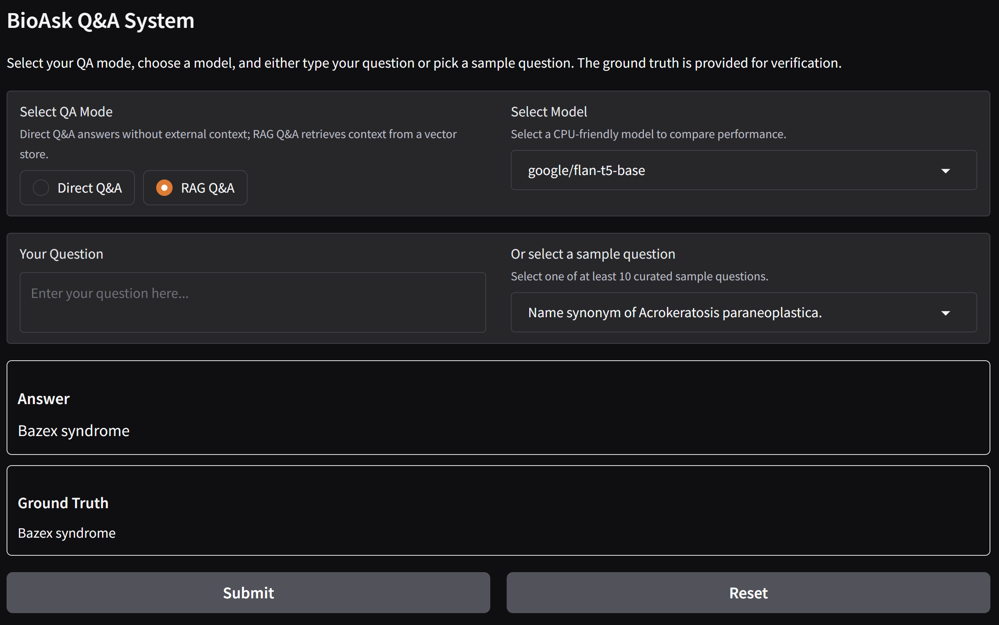

# Comprehensive RAG Q&A System

This project implements a Retrieval-Augmented Generation (RAG) Question Answering system. It integrates multiple components for direct question answering as well as retrieval-augmented generation by leveraging vector-based retrieval and language models. The system is designed to work with BioASQ dataset, but can be used with any context.

## Project Overview

The system supports two main QA modes:

1. **Direct Q&A**: Answers questions directly using a language model without external context.
2. **RAG Q&A**: Retrieves context from a pre-built vector store and uses that information to generate answers. This mode enhances answer quality when the answer is not fully contained in the language model’s training data.

The system utilizes the following key components:
- **Language Models**: CPU-friendly models like `google/flan-t5-base` (others are supported via configuration).
- **Vector Store**: Built using FAISS with HuggingFace embeddings (`all-mpnet-base-v2`) to retrieve relevant documents from a dataset.
- **Prompt Templates**: Custom templates to guide answer generation both for direct and retrieval-augmented modes.
- **Gradio Interface**: A web interface that allows users to interact with the QA system and choose different modes and models.
## Usage Example



## Setup Instructions

1. **Clone the Repository**

   ```bash
   git clone https://github.com/SivaTSS/BioAsk-RAG.git
   cd BioAsk-RAG
   ```

2. **Create a Virtual Environment**

   ```bash
   python -m venv venv
   source venv/bin/activate 
   ```

3. **Install Dependencies**

   ```bash
   pip install -r requirements.txt
   ```

4. **Prepare the Data**

   - Ensure that the BioASQ dataset is available at the expected path (e.g., `../data/BioASQ-train-factoid-6b-full-annotated.json`).
   - Build the FAISS vector store by running the `prepare_vectorstore.py` script:

     ```bash
     python src/prepare_vectorstore.py
     ```

5. **Set Up Databases (to provide required context for RAG)**

   If you plan to extend the system with relational or graph databases, set up the respective databases and adjust the configuration accordingly.

## Running the Application

Launch the Gradio interface by running:

```bash
python src/app.py
```

- **Direct Q&A Mode**: Use the “Direct Q&A” option to get answers without external context.
- **RAG Q&A Mode**: Use the “RAG Q&A” option to retrieve context from the vector store and generate answers.
- **Model Selection**: Choose a CPU-friendly model from the dropdown.
- **Sample Questions**: Either type your own question or select from a list of curated sample questions.


